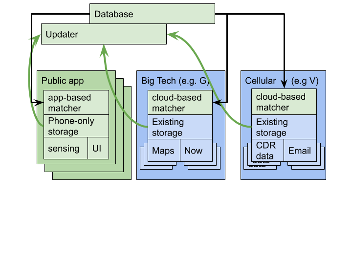

# Shared exposure database
-----

This repository outlines a common backend data service to publicly share information about positive or suspected cases. The big idea behind this service is to allow all apps and government agencies to publish and query facts ("features") at intervals in time and space.  Each published fact would be signed by the publishing entity.  The data service would be public (like twitter) so that anyone (or app) can query/follow regions of space and time for posts (like tweets).  This would allow CDC to publish official positive case counts to regions of time and space as well as notifications for testing people that may have passed through certain regions of space-time.  It would also allow "IFeelSick" apps to publish counts of people who feel sick (but were not tested) to space and time intervals they occupied.

This results in a tracing model where users (the apps on their mobile devices) maintain their travel history locally and query the public data service for regions of space and time and the counts of positive and likely positive cases.  They can locally estimate the chance that they may have been exposed.  If they test positive, users can publish their track to the CDC who can update the space-time counts (signed by the CDC).  If they feel sick they can use any of the apps to update the space-time cells they occupied with additional counts.

### Importance of sharing

Using a standard format (lat,lon,time,count) for the exposure database enables interoperability between different applications. This enables various opt-in models to potentially increase adoption.   in which the open source components are in green and the closed source components are in blue. Open source app(s) use the reference implementation for transparent, time-limited, privacy-preserving data collection, while private companies can choose to run the matching algorithm on their existing data. All data upload should be opt-in with explicit user consent.

This allows us to address both adoption and trust issues.
**Trust:** WHO/CDC/non-profit consortium should provide an open source "public option" app that does not depend on any third-parties and does the matching directly on the phone. This: a) removes the dependency on big tech, since people can always fall back to the public option, and b) it sidesteps accusations of govt-tech collusion. Alice cares about privacy, so she can use the public option, Bob cares about convenience, so he can use the Google/Verizon option that works with their existing data collection.
**Adoption:** Since the exposure database is public, and the matching algorithm is open source, any company can integrate with it to provide contact tracing as a service to their existing users. For example, Google could add a “COVID-19 exposure” section to Google Now, similar to the existing weather or stock sections. Timeline upload for positive users then fits into their business model of collecting data to provide services.

